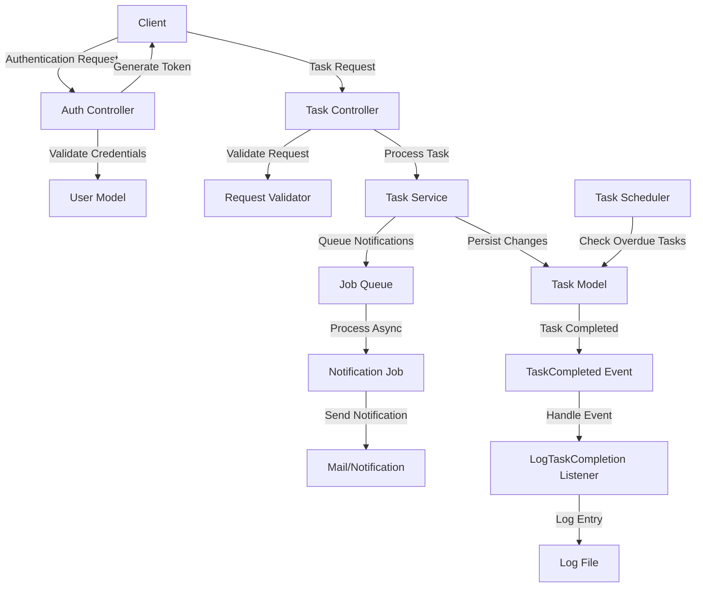
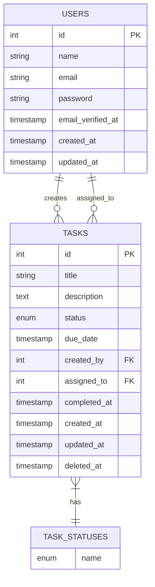

# Architecture Documentation

This document provides an overview of the Task Management System's architecture, including system flow, entity relationships, and design principles.

**Navigation:**
- [Back to Main README](../README.md)
- [Installation & Setup Guide](installation.md)
- [API Documentation](api.md)
- [Postman Collection Guide](postman.md)

## System Flow

The following diagram illustrates the flow of data and operations through the system:



## Entity Relationship Diagram

The following diagram shows the database structure and relationships:



## Directory Structure

```
task-management-system/
├── app/                            # Application core
│   ├── Console/                    # Console commands
│   │   └── Commands/
│   │       └── ExpireOverdueTasks.php
│   ├── Enums/                      # PHP Enums
│   │   └── TaskStatus.php
│   ├── Events/                     # Laravel events
│   │   └── TaskCompleted.php
│   ├── Http/                       # HTTP layer
│   │   ├── Controllers/
│   │   │   ├── Api/                # API controllers
│   │   │   │   ├── AuthController.php
│   │   │   │   └── TaskController.php
│   │   │   └── Controller.php      # Base controller
│   │   ├── Middleware/
│   │   │   └── RequestExecutionTimeLogger.php
│   │   ├── Requests/               # Form requests & validation
│   │   │   ├── LoginRequest.php
│   │   │   ├── RegisterRequest.php
│   │   │   ├── TaskAssignRequest.php
│   │   │   ├── TaskCompleteRequest.php
│   │   │   ├── TaskCreateRequest.php
│   │   │   └── TaskIndexRequest.php
│   │   └── Resources/              # API resources
│   │       ├── TaskResource.php
│   │       └── UserResource.php
│   ├── Jobs/                       # Queued jobs
│   │   └── SendTaskAssignmentNotification.php
│   ├── Listeners/                  # Event listeners
│   │   └── LogTaskCompletion.php
│   ├── Mail/                       # Mail templates
│   │   └── TaskAssigned.php
│   ├── Models/                     # Eloquent models
│   │   ├── Task.php
│   │   └── User.php
│   ├── Policies/                   # Authorization policies
│   │   └── TaskPolicy.php
│   ├── Providers/                  # Service providers
│   │   ├── AppServiceProvider.php
│   │   ├── AuthServiceProvider.php
│   │   └── EventServiceProvider.php
│   └── Services/                   # Business logic services
│       ├── Interfaces/
│       │   └── TaskServiceInterface.php
│       └── TaskService.php
├── bootstrap/                      # Application bootstrap files
├── config/                         # Configuration files
├── database/                       # Database migrations and seeds
├── docs/                           # Documentation files
│   ├── api.md                      # API Documentation
│   ├── architecture.md             # Architecture Documentation
│   ├── installation.md             # Installation & Setup Guide
│   ├── postman.md                  # Postman Collection Guide
│   └── postman/                    # Postman Collection Files
│       ├── task-management-system.postman_collection.json
│       └── task-management-system ( Development ).postman_environment.json
├── public/                         # Publicly accessible files
├── resources/                      # Views and uncompiled assets
├── routes/                         # Route definitions
│   ├── api.php
│   ├── console.php
│   └── web.php
├── storage/                        # Application storage
├── tests/                          # Test cases
├── vendor/                         # Composer dependencies
└── README.md                       # Main README with links to docs
```
## Key Directories and Files

### API Controllers
These handle the HTTP requests and responses:
- `AuthController.php` - Handles authentication (register, login, logout)
- `TaskController.php` - Manages task CRUD operations, assignment, and completion

### Request Validation
Form requests that handle validation of incoming data:
- `TaskCreateRequest.php` - Validates task creation data
- `TaskAssignRequest.php` - Validates task assignment
- `TaskCompleteRequest.php` - Validates task completion
- `TaskIndexRequest.php` - Validates task listing with filters
- `LoginRequest.php` - Validates login credentials
- `RegisterRequest.php` - Validates user registration data

### Models
Database models with relationships and business logic:
- `User.php` - User model with task relationships
- `Task.php` - Task model with user relationships and status management

### Services
Business logic separated from controllers:
- `TaskServiceInterface.php` - Interface defining task operations
- `TaskService.php` - Implementation of task business logic

### API Resources
Transform models into JSON responses:
- `TaskResource.php` - Formats task data for API responses
- `UserResource.php` - Formats user data for API responses

### Enums
Type-safe enumerations:
- `TaskStatus.php` - Defines possible task statuses (pending, completed, expired)

### Jobs & Events
Asynchronous processing:
- `SendTaskAssignmentNotification.php` - Queued job for sending notifications
- `TaskCompleted.php` - Event fired when a task is completed
- `LogTaskCompletion.php` - Listener that logs task completions

### Policies
Authorization policies:
- `TaskPolicy.php` - Defines who can perform actions on tasks

### Mail
Email notifications:
- `TaskAssigned.php` - Email template for task assignment notifications

### Middleware
HTTP middleware:
- `RequestExecutionTimeLogger.php` - Logs execution time of requests

### Commands
Artisan commands:
- `ExpireOverdueTasks.php` - Command to mark overdue tasks as expired

## SOLID Principles

The Task Management System is designed following SOLID principles:

### 1. Single Responsibility Principle

Each class has a single responsibility:
- `TaskController` handles HTTP requests
- `TaskService` contains business logic
- `Task` model manages database interactions

### 2. Open/Closed Principle

Classes are open for extension but closed for modification:
- New task statuses can be added without modifying existing code
- New notification types can be added by extending base classes

### 3. Liskov Substitution Principle

TaskService implements TaskServiceInterface:
- Any class implementing TaskServiceInterface can be substituted without affecting functionality

### 4. Interface Segregation Principle

Using specific interfaces:
- Custom interfaces define only the methods needed by their clients
- No forced implementation of unnecessary methods

### 5. Dependency Inversion Principle

Dependencies are injected rather than hardcoded:
- Controllers depend on interfaces, not concrete implementations
- Service bindings configured in service providers

## System Components

### Controllers

Controllers handle HTTP requests and responses. They:
- Validate incoming requests
- Call appropriate services to handle business logic
- Return appropriate responses

### Services

Services contain business logic separated from controllers. They:
- Implement domain-specific operations
- Interact with models
- Dispatch jobs and events
- Handle complex business rules

### Models

Models represent database tables and handle:
- Data structure and relationships
- Query scopes
- Attribute mutators and accessors

### Middleware

Custom middleware for:
- Request execution time logging (stored in `storage/logs/request/laravel-{date}.log`)
- Additional request validation
- Response transformation

The `RequestExecutionTimeLogger` middleware captures how long each API request takes to process and logs this information to a dedicated request log file, making it easy to identify performance bottlenecks.


### Events and Listeners

Event-driven architecture for:
- Task status changes
- User notifications
- System logging (task completions are logged to `storage/logs/task/laravel-{date}.log`)

The system uses Laravel's event system to decouple actions from their side effects. For example, when a task is completed, the `TaskCompleted` event is fired, which then triggers the `LogTaskCompletion` listener, writing detailed information to a dedicated task log file.


### Jobs and Queues

Background processing for:
- Email notifications
- Report generation
- Task status updates

### Console Commands

Scheduled tasks for:
- Expiring overdue tasks
- Generating reports
- System maintenance


## API Security

The Task Management System implements a comprehensive security approach:

### Authentication

- **Laravel Sanctum**: Used for API token authentication
- **Token-based Authentication**: Each API request (except registration and login) requires a valid token
- **Token Management**: Tokens are issued at login and invalidated at logout
- **Token Scopes**: Can be implemented to restrict access to specific endpoints

### Authorization

- **Laravel Policies**: The `TaskPolicy` defines rules for who can perform specific actions on tasks
- **Role-based Access**: Users can only perform actions appropriate to their role:
  - Users can only view and modify their own tasks or tasks assigned to them
  - Task creators have additional privileges over the tasks they created

### Request Validation

- **Form Request Classes**: Each API endpoint uses dedicated request validation classes
- **Input Sanitization**: All user input is validated and sanitized before processing
- **Custom Validation Rules**: Applied for task-specific validations (e.g., due dates must be in the future)

### API Security Best Practices

- **CSRF Protection**: Not required for token-based APIs (as per Laravel documentation)
- **Rate Limiting**: Can be implemented using Laravel's built-in rate limiting middleware
- **Response Headers**: Security headers are set in the web server configuration
- **Logging**: Security-related events are logged for audit purposes
